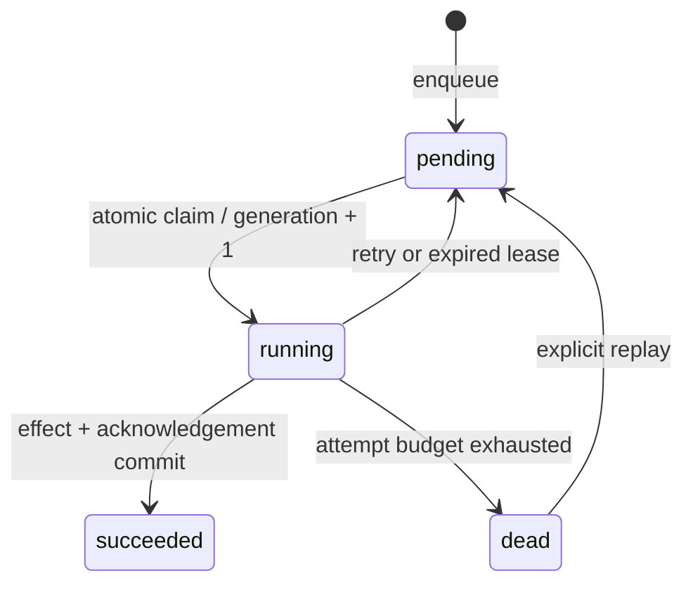

# Architecture and guarantees

ForgeQueue coordinates independent worker processes through PostgreSQL. Workers can run on different hosts as long as they connect to the same primary. The recorded benchmark uses processes on one machine, not a multi-host cluster.

## Claims and ownership

`FOR UPDATE SKIP LOCKED` lets competing workers select disjoint available jobs. The claim transaction updates state, increments attempts and generation, assigns an owner, and sets a deadline using the database clock. A generation is a fencing token: completion, failure and heartbeat must match both owner and generation and start before expiry. Queue names isolate consumers and deduplication keys.

The ready index excludes terminal jobs. The lease index supports bounded recovery scans. Claims prioritize larger priority values, then availability and ID. This is best-effort ordering under concurrency; continuously arriving high-priority jobs can starve others.

## Effects and crashes

The `complete(job, effect)` callback runs under the job row lock. Its database changes and completion record commit in the same transaction. A process killed before commit loses both; killed after commit retains both. A competing reclaimer skips this locked row, so a valid transaction that began before expiry can finish after the nominal deadline. Keep transactions short and set timeouts. The default worker sets 4-second statement and idle-in-transaction timeouts.

Handlers may be invoked again after a crash. The guarantee is **at-least-once delivery with duplicate-safe committed PostgreSQL effects**, not exactly-once handler invocation. The supplied callback must use only its provided connection, must not commit independently, and must not modify queue state. Remote APIs, email, files, and other databases are outside this atomic boundary. Use a transactional outbox plus downstream idempotency keys for those effects.

For lengthy computation, claim a job, renew its lease explicitly from a separate connection before expiry, and pass the final result into a short completion transaction. A missed heartbeat can cause overlapping computation, but fencing still rejects stale commits. Lease expiry is not cancellation of an external operation.

## Retries and dead letters

Failure schedules `min(cap, base * 2 ** (attempt - 1))` seconds later. All claims consume an attempt, including claims abandoned by a crash. Expired jobs are retried immediately by the reclaimer unless their attempt budget is exhausted. Dead jobs retain payload, error, attempts and event history. Replay resets attempts, preserves generation monotonicity, and is an explicit operator action.

## Operations

Run one Queue connection per worker. The CLI worker reclaims expired work each loop, handles SIGTERM/SIGINT after its current job, and reports failures through Python logging. Supervise processes with your service manager to restart them after database outages. PostgreSQL remains the durable source of truth; use normal backups, monitoring and failover appropriate to your deployment.

The six-second recovery target assumes a five-second lease, a healthy reachable database, short/terminated transactions and a promptly scheduled reclaimer. It is a measured test bound, not a guarantee through a database outage, network partition, suspended process, or unbounded transaction. The bulk crash test measures return to pending, separately from completion time.

Keep `fsync`, `synchronous_commit` and `full_page_writes` enabled for the stated durability configuration. Restrict database credentials and network access in deployment. The compose credentials are for local development. Purging a completed job also removes its idempotency key; retain keys for your business deduplication window. Audit records and completed jobs are retained until an operator applies a retention policy. This initial schema uses an idempotent bootstrap migration; future schema changes require versioned migrations.

## References

- [PostgreSQL SELECT and SKIP LOCKED](https://www.postgresql.org/docs/16/sql-select.html)
- [Psycopg transaction management](https://www.psycopg.org/psycopg3/docs/basic/transactions.html)
